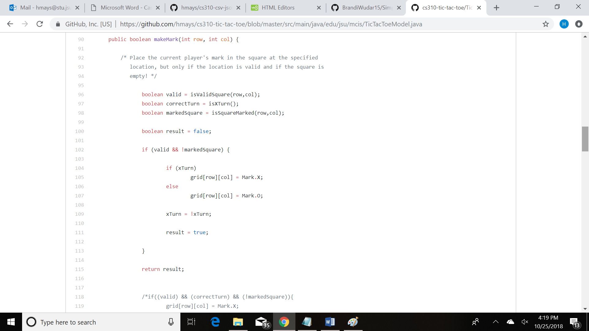
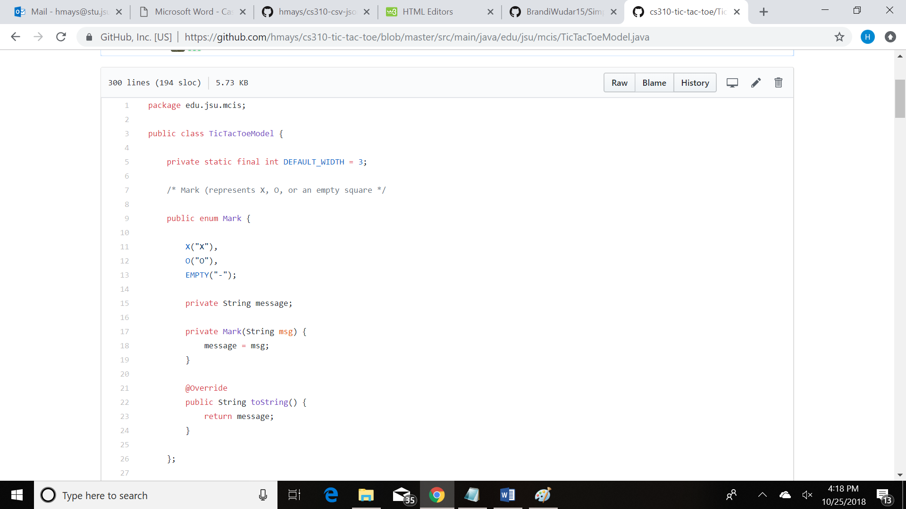
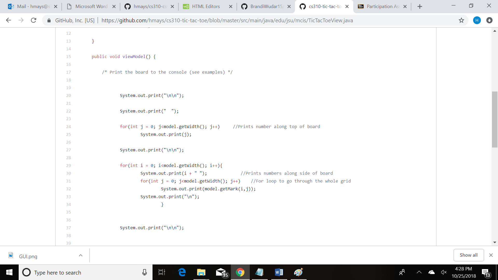

<!DOCTYPE html>
<html>
  

<body>

 <h1>A BRIEF OVERVIEW</h1>
 

This is a 2-player tic-tac-toe game that I created at Jacksonville State University. This was an individual project assigned by professor
Jason Snellen. Like many of his assignments, he provided the documentation and the skeleton for this assignment. This first part of this 
project was to create a basic tic tac toe game that could run using basic text. The second portion of this project was implementing Java's
GUI. This made the game look much more professional and created a challenge for me because I had never worked with GUI before.

<h1>CLASS FILES</h1>
 
<h2>Main File</h2>
		

The main file of this project simply creates instances of a Model, View, and Controller. This is the skeleton that was required when creating this project. It provides more organization. Below is an image of the main class creating instances:

	
			 

 

<h2>Model Class File</h2>

The main purpose of the model class was to handle all of the “behind the scenes” actions. The model class contains methods such as makeMark, isMarkValid, and isWinner. Just like their names, these methods are what allow the players to select squares on the board and then the methods are called to check for validity. The model is also where an ENUM class is created to represent the marks, X, O, and EMPTY. This made it much more simple to check whether there was a winner or if the selected location was valid.
Below is the makeMark method:

 

Below is the ENUM class:

 

<h2>View Class File</h2>

The view class contains code that prints to the screen the actual game board that the players see. This is where I gained experience using the G.U.I in java. Creating the actual game board code was not very difficult. Below is what the user saw when playing the game:

 

		
<h1>WHAT DID I LEARN?</h1>

	<ul>
		<li>How to use Java’s G.U.I</li>
		<li> How to create a two player game </li>
		<li>How to use a Model, View, Controller</li>
		
	</ul>		

	
 
 
 
 
</body>
  

  </html>

